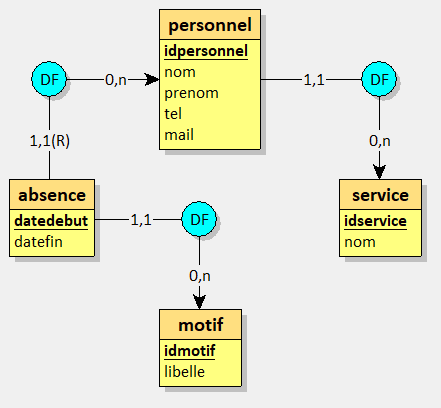
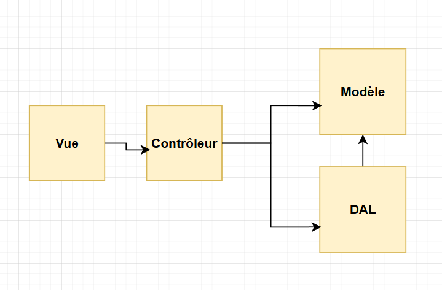
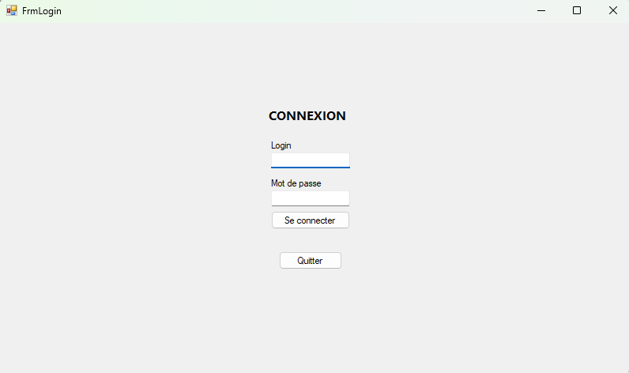
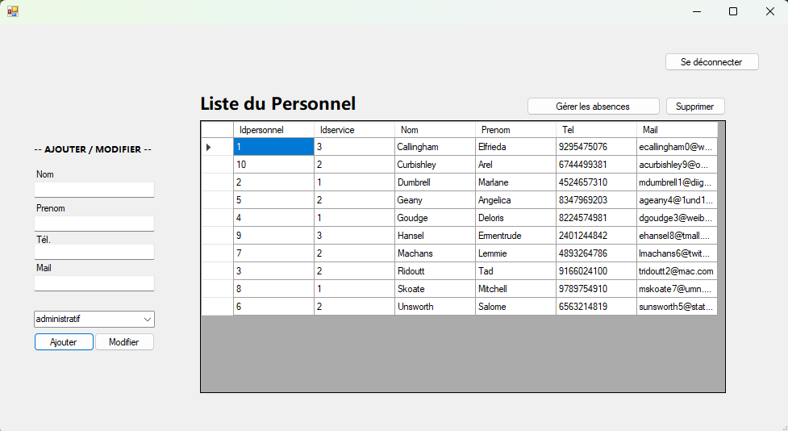
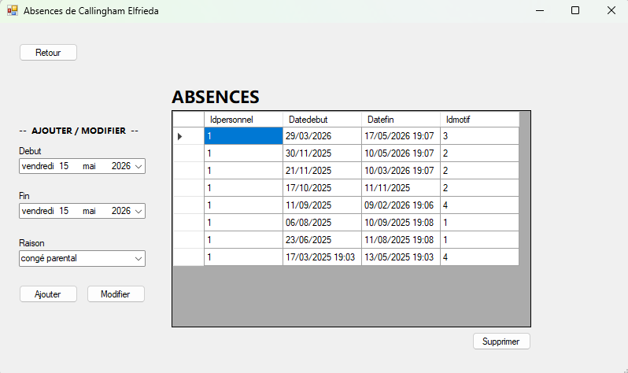

## Présentation

**Titre :** MediaTek86

**Description :** Une application Windows Forms qui permet au responsable RH de gérer la liste des employés ainsi que leurs absences.

**Outils utilisés :** C#, MySQL, Architecture MVC

## Modèle Conceptuel de Données

## Architecture

L'application respecte l'architecture Modèle Vue Contrôleur permettant de séparer l'affichage, la logique métier et l'accès aux données.

4 paquetages principaux composent le code :
* **Vue :** Contient les interfaces graphiques (FrmMain, FrmAbsences, FrmLogin)
* **Contrôleur :** Fait le pont entre les vues et les données
* **Modèle :** Contient les classes métiers qui définissent les objets de l'application (Personnel, Service, Absence, Motif)
* **DAL (Data Access Layer) :** Pour gérer la connexion à la base de données MySQL et l'exécution des requêtes SQL
**Diagramme de paquetages :**

## Interfaces de l'application

**Fenêtre de connexion**

**Gestion du personnel**

**Gestion des absences**

## Historique des modifications

* **Commit 1 :** Création du projet et de la base de données
